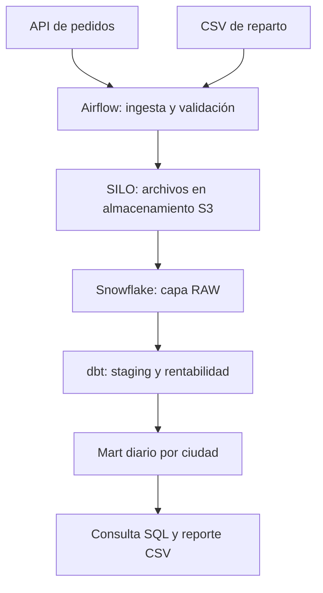

# RutaNova — Rentabilidad de pedidos y reparto

Proyecto final de la especialización en Apache Airflow, desarrollado por José Benítez.

RutaNova reúne pedidos de una API y costos de reparto de un archivo CSV para calcular el margen diario por ciudad. Airflow coordina la ingesta, el almacenamiento de los archivos, la carga en Snowflake, las transformaciones con dbt y la generación de un reporte CSV.

Las fuentes contienen datos simulados incluidos en el proyecto. La carga y las consultas se ejecutan en una cuenta real de Snowflake.

## Resultado de negocio

La pregunta que responde el proyecto es: **¿qué ciudad deja más margen después de descontar el costo del producto y del reparto?**

El cálculo considera únicamente pedidos entregados:

```text
Margen de contribución = ingreso − costo del producto − costo de reparto
Porcentaje de margen = margen de contribución / ingreso × 100
```

El porcentaje por ciudad se calcula sobre los importes acumulados, sin promediar los porcentajes de cada pedido. Este margen no representa utilidad neta, ya que no incluye impuestos ni gastos fijos.

El ejemplo contiene 18 pedidos entre el 1 y el 3 de octubre de 2026: 15 entregados y 3 cancelados. Con los archivos originales, los totales de referencia son S/ 2,850.00 de ingresos y S/ 779.00 de margen. Estos valores se pueden comprobar con `sql/02_validate_results.sql`.

Las fechas de los datos son fijas; ejecutar el DAG otro día no modifica el período del ejemplo.

## Arquitectura



PostgreSQL almacena los metadatos de Airflow: ejecuciones, tareas, usuarios y conexiones. Los datos del negocio se procesan en Snowflake.

El almacenamiento local utiliza SILO, compatible con S3, mediante la imagen `pgsty/minio`. Los servicios de Compose conservan los nombres `minio` y `minio-init`, al igual que la conexión `rutanova_minio`.

## Herramientas y requisitos

| Componente | Versión o configuración |
|---|---|
| Apache Airflow | 2.10.5, con LocalExecutor |
| Python | 3.11 en los contenedores |
| dbt-core | 1.9.4 |
| dbt-snowflake | 1.9.2 |
| PostgreSQL | 16.8-alpine |
| Almacenamiento S3 | `pgsty/minio:RELEASE.2026-08-04T00-00-00Z` |
| Cliente de almacenamiento | `clickhouse/minio-mc:RELEASE.2025-04-16T18-13-26Z` |
| Warehouse | Snowflake, tamaño XSMALL |

Para ejecutar el proyecto necesitas:

- Docker Desktop con WSL2 y contenedores Linux en Windows, o Docker Engine con Compose v2 en Linux/macOS.
- Python 3.11 o superior para generar la configuración local.
- Una cuenta de Snowflake con permisos para crear los recursos del laboratorio.
- Conexión a internet y los puertos locales 8081 y 9001 disponibles.
- Git y una cuenta de GitHub para publicar la entrega.

Se recomienda disponer de 8 GB de RAM para Docker y 10 GB de espacio en disco. Airflow se ejecuta dentro de Docker; no hace falta instalarlo en Windows. Snowflake se utiliza como servicio en la nube y su interfaz web es Snowsight.

## Archivos del proyecto

| Archivo o carpeta | Contenido |
|---|---|
| `docker-compose.yaml` | Servicios, puertos, volúmenes y dependencias de arranque. |
| `Dockerfile` | Imagen de Airflow con las dependencias y archivos del proyecto. |
| `requirements.txt` | Dependencias de Python para Airflow y las integraciones. |
| `.env.example` | Referencia de las variables de configuración. |
| `api/` | API local y archivo `orders.json` con los pedidos de ejemplo. |
| `inbox/` | Archivo `delivery_costs.csv` con los costos de reparto. |
| `dags/` | Definición del DAG `rutanova_profitability`. |
| `src/` | Validaciones de negocio e integración con API, S3, Snowflake y dbt. |
| `dbt/` | Modelos SQL, configuración y pruebas de calidad. |
| `sql/` | Preparación de Snowflake y consultas de validación. |
| `scripts/` | Generación de configuración y claves, inicialización y utilidades. |
| `config/` | Política de acceso al bucket de almacenamiento. |
| `tests/` | Pruebas de negocio y de estructura del DAG. |
| `.github/workflows/` | Flujo de integración continua con GitHub Actions. |
| `docs/` | Documentación, PDF de arquitectura y capturas de ejecución. |
| `reports/` | Reporte CSV generado al terminar el DAG. |
| `secrets/` | Claves locales de Snowflake; no se publican en GitHub. |
| `VALIDACION.md` | Registro de validaciones y evidencias del proyecto. |

## Ejecución desde cero

Ejecuta los comandos desde la carpeta `rutanova`, donde se encuentra `docker-compose.yaml`. Los ejemplos funcionan en CMD de Windows; en otros sistemas utiliza la ruta correspondiente.

### 1. Abrir la carpeta y comprobar Docker

Abre Docker Desktop y luego una terminal:

```bat
cd /d C:\Users\jose\Downloads\Proyecto_Final_RutaNova_Docker\rutanova
docker --version
docker compose version
python --version
```

Si Windows reconoce `py` en lugar de `python`, utiliza `py` para ejecutar los scripts locales.

### 2. Generar la configuración

```bat
python scripts/configure.py
```

El script crea `.env` con las variables y contraseñas del laboratorio. Completa `SNOWFLAKE_ACCOUNT` con el identificador de tu cuenta, en formato `organizacion-cuenta`, sin `https://` ni `.snowflakecomputing.com`.

Puedes obtener este identificador desde los detalles de la cuenta en Snowsight. Conserva los nombres de base de datos, warehouse, rol y usuario si vas a utilizar el SQL incluido.

Las credenciales de las interfaces locales están en estas variables:

| Interfaz | Usuario | Contraseña |
|---|---|---|
| Airflow | `AIRFLOW_ADMIN_USER` | `AIRFLOW_ADMIN_PASSWORD` |
| SILO | `MINIO_ROOT_USER` | `MINIO_ROOT_PASSWORD` |

No publiques `.env` ni muestres su contenido durante la grabación. Si ya tienes una configuración funcionando, consérvala.

### 3. Construir la imagen y generar las claves

```bat
docker compose build
docker compose --profile tools run --rm keygen
```

La primera construcción puede tardar varios minutos. El segundo comando genera:

- `secrets/snowflake_key.p8`: clave privada utilizada por el pipeline.
- `secrets/snowflake_public_key.txt`: clave pública que se registra en Snowflake.

La clave privada se monta en el contenedor desde la carpeta local y no se incluye en la imagen. El laboratorio utiliza una clave sin contraseña; una implementación de producción requeriría gestionar este secreto de acuerdo con sus políticas de seguridad.

### 4. Preparar Snowflake

En Snowsight, abre una worksheet SQL con el usuario administrador del laboratorio.

1. Copia el contenido de `sql/01_setup_snowflake.sql`.
2. Reemplaza `PUBLIC_KEY_REPLACE` por la clave pública completa, en una sola línea y conservando las comillas del SQL.
3. Ejecuta las instrucciones en orden, desde `USE ROLE ACCOUNTADMIN`. Selecciona todo el script para ejecutarlo completo, o ejecuta cada instrucción por separado.
4. Comprueba que se crearon `RUTANOVA_WH`, `RUTANOVA`, los esquemas `RAW` y `ANALYTICS`, el rol `RUTANOVA_ROLE` y el usuario `RUTANOVA_SVC`.
5. Asigna también `RUTANOVA_ROLE` a tu usuario de Snowsight para poder revisar los resultados.

Para conocer tu usuario y asignarle el rol:

```sql
SELECT CURRENT_USER();

USE ROLE ACCOUNTADMIN;
GRANT ROLE RUTANOVA_ROLE TO USER TU_USUARIO;
```

Reemplaza `TU_USUARIO` por el nombre obtenido. Si el nombre requiere comillas, conserva su escritura exacta entre comillas dobles.

El pipeline se conecta con `RUTANOVA_SVC` y `RUTANOVA_ROLE`. `ACCOUNTADMIN` se utiliza para preparar el laboratorio.

En la copia pública del SQL debe quedar `PUBLIC_KEY_REPLACE`; la clave registrada pertenece a la configuración de tu cuenta.

### 5. Iniciar los servicios

```bat
docker compose pull minio minio-init
docker compose up -d
docker compose ps -a
```

`airflow-init` y `minio-init` son procesos de inicialización: es normal que aparezcan como `Exited (0)`. El scheduler, el webserver, PostgreSQL, la API y el almacenamiento deben permanecer activos. Airflow puede mostrar `health: starting` mientras termina de arrancar.

La inicialización registra las conexiones `rutanova_api`, `rutanova_minio` y `rutanova_snowflake`. Las contraseñas de las conexiones se almacenan cifradas con Fernet en PostgreSQL.

Para revisar problemas de arranque:

```bat
docker compose logs airflow-init minio-init
docker compose logs --tail 100 airflow-scheduler airflow-webserver
```

El webserver utiliza este mapeo en `docker-compose.yaml`:

```yaml
ports:
  - "127.0.0.1:8081:8080"
```

8081 es el puerto del equipo y 8080 el del contenedor. El healthcheck interno sigue apuntando a 8080.

### 6. Ejecutar el DAG

Abre [Airflow](http://localhost:8081), inicia sesión y busca `rutanova_profitability`. Activa el DAG y pulsa **Trigger DAG**.

También puedes hacerlo desde la terminal:

```bat
docker compose exec airflow-scheduler airflow dags unpause rutanova_profitability
docker compose exec airflow-scheduler airflow dags trigger rutanova_profitability
```

El DAG está programado para las 07:00 de Lima, con `catchup=False` y una sola ejecución activa a la vez. Al activarlo puede aparecer una ejecución programada además de la manual.

| Tarea | Qué realiza |
|---|---|
| `ingestion.wait_delivery_csv` | Espera un CSV no vacío; usa `reschedule` para liberar el worker entre comprobaciones. |
| `ingestion.archive_api` | Consulta y valida los pedidos; guarda el JSON en S3. |
| `ingestion.archive_csv` | Valida y guarda el CSV de reparto en S3 después del sensor. |
| `warehouse.load_atomic_snapshot` | Reconcilia las fuentes y carga las tablas RAW en una transacción. |
| `transformation.dbt_build` | Ejecuta los modelos y pruebas de dbt. |
| `export_report` | Consulta el mart final y genera el reporte CSV. |

La API puede procesarse mientras el sensor espera el CSV. La carga a Snowflake comienza cuando las dos fuentes están disponibles. El DAG tiene dos reintentos para las tareas que heredan la configuración general; el sensor tiene un tiempo máximo de espera de diez minutos y no realiza reintentos adicionales.

dbt se ejecuta mediante un `PythonOperator` que lanza `dbt build`. Esta implementación utiliza la alternativa de operador indicada en la sección 5.3 del enunciado; no utiliza Cosmos.

### 7. Revisar resultados y pruebas

Espera a que la ejecución termine con todas las tareas en `success`.

- En [SILO](http://localhost:9001), revisa el bucket `rutanova-raw` y la carpeta `snapshots/`. Cada ejecución guarda un JSON de pedidos y un CSV de costos.
- En Snowflake, ejecuta `sql/02_validate_results.sql`.
- En el equipo, abre `reports/city_profitability.csv`.
- En Airflow, revisa el log de `transformation.dbt_build`.

Consulta principal:

```sql
USE ROLE RUTANOVA_ROLE;
USE WAREHOUSE RUTANOVA_WH;
USE DATABASE RUTANOVA;

SELECT *
FROM ANALYTICS.MART_CITY_PROFITABILITY
ORDER BY ORDER_DATE, CITY;

SELECT
    SUM(DELIVERED_ORDERS) AS DELIVERED_ORDERS,
    SUM(TOTAL_REVENUE) AS REVENUE,
    SUM(CONTRIBUTION_MARGIN) AS CONTRIBUTION_MARGIN
FROM ANALYTICS.MART_CITY_PROFITABILITY;
```

Pruebas de Python:

```bat
docker compose exec airflow-scheduler python -m pytest tests -q
```

Para volver a ejecutar los modelos y las pruebas de dbt usando la conexión de Airflow:

```bat
docker compose exec airflow-scheduler python -c "from src.runtime import dbt_build; dbt_build()"
```

Ejecuta este último comando después de terminar el DAG, para evitar dos construcciones simultáneas.

## Modelos y controles de calidad

| Modelo | Nivel de detalle y función |
|---|---|
| `stg_orders` | Un pedido; normaliza ciudad, estado y tipos de datos. |
| `stg_delivery_costs` | Un costo de reparto por pedido. |
| `int_order_profitability` | Un pedido entregado; calcula su margen y porcentaje. |
| `mart_city_profitability` | Una fecha y ciudad; acumula importes y calcula el porcentaje de margen. |

La carga RAW reemplaza el snapshot completo mediante `DELETE` e `INSERT` dentro de una transacción. Si falla, se ejecuta `ROLLBACK`. Repetir una ejecución no agrega copias de los pedidos ni publica una carga incompleta. Las tablas se crean antes de iniciar la transacción.

RAW conserva el snapshot actual; los archivos de las ejecuciones anteriores permanecen en el almacenamiento S3. Esta carga está pensada para el volumen del laboratorio y no implementa CDC ni procesamiento incremental.

Las validaciones comprueban duplicados, campos obligatorios, estados permitidos, relaciones entre pedidos y costos, cobertura de costos de los pedidos entregados y reconciliación de los resultados. Un margen negativo es válido; si el ingreso es cero, el porcentaje queda en `NULL`.

Si una validación falla, el pipeline se detiene y el reporte no se genera para esa ejecución. XCom transporta referencias a archivos y conteos, sin pasar los conjuntos completos de datos ni las credenciales.

## Evidencia de ejecución

Validación realizada el **4 de octubre de 2026** con Docker local y una cuenta real de Snowflake:

| Verificación | Resultado |
|---|---|
| DAG de Airflow | Todas las tareas en `success`. |
| Pruebas de Python | `15 passed in 2.03s`. |
| Modelos dbt | 4 construidos: 3 vistas y 1 tabla. |
| Pruebas de datos dbt | 20 aprobadas. |
| Resumen de dbt | `PASS=24 WARN=0 ERROR=0 SKIP=0 TOTAL=24`. |
| Mart final en Snowflake | 9 filas, una por fecha y ciudad. |
| Archivos de las fuentes | JSON y CSV disponibles en el bucket. |

`PASS=24` incluye los cuatro modelos y las veinte pruebas; no corresponde a veinticuatro pruebas.

La arquitectura está documentada en [Arquitectura_RutaNova.pdf](docs/Arquitectura_RutaNova.pdf). Las capturas se guardan en [docs/evidencias/](docs/evidencias/) y el detalle de validaciones en [VALIDACION.md](VALIDACION.md).

## GitHub y entrega

El workflow `.github/workflows/ci.yml` incluye dos jobs:

- `business-tests`: ejecuta las pruebas de negocio con Python.
- `docker-dag-tests`: construye la imagen, ejecuta las pruebas dentro del contenedor y valida el proyecto dbt con `dbt parse`.

Se ejecuta en los Pull Requests hacia `main` y en los pushes a `main`. CI utiliza valores de prueba para parsear dbt y no se conecta a Snowflake. La construcción y las pruebas sobre datos reales se realizan en el entorno local y en el DAG.

Para la publicación, sigue la guía de GitHub de la entrega: crea una rama de trabajo, conserva commits que describan los cambios, abre un Pull Request y configura la protección de `main` con los checks obligatorios. La ejecución local documentada aquí no sustituye la evidencia de GitHub Actions y del PR.

La entrega al profesor incluye:

1. Repositorio público de GitHub con código, documentación y evidencias.
2. Video de entre 5 y 8 minutos mostrando Airflow, el PR con CI y los resultados en Snowflake.
3. PDF de arquitectura de dos páginas con los enlaces reales al repositorio y al video.

El PDF actualizado tiene campos editables para completar esos enlaces. Guarda la versión completada como `docs/Arquitectura_RutaNova.pdf`. El script original `scripts/generate_architecture.py` genera el diseño anterior; no lo utilices para sobrescribir el PDF actualizado.

El proyecto incluye CI. El despliegue local se realiza con Docker Compose; no se ha implementado CD automático.

## Ajustes realizados durante la ejecución

| Problema encontrado | Ajuste aplicado |
|---|---|
| Error `401 Unauthorized` al descargar las imágenes originales de Quay. | Se utilizaron las imágenes `pgsty/minio` y `clickhouse/minio-mc` indicadas en este README. |
| El puerto 8080 estaba ocupado por otra instalación de Airflow. | Se cambió el puerto del equipo a 8081, manteniendo 8080 dentro del contenedor. |
| Snowflake rechazaba el JWT por una huella de clave pública diferente. | Se registró la clave pública correspondiente a la clave privada usada por el contenedor. |
| No existían la base de datos o el warehouse al otorgar permisos. | Se ejecutó el script de preparación en orden, creando primero los recursos. |
| Cinco pruebas fallaban por no encontrar `api/orders.json`. | Se incluyeron las carpetas `api/` e `inbox/` en la imagen de Airflow, se reconstruyó y se recrearon los contenedores. |

El Dockerfile corregido incluye estas instrucciones junto con las demás carpetas del proyecto:

```dockerfile
COPY --chown=airflow:root api /opt/airflow/api
COPY --chown=airflow:root inbox /opt/airflow/inbox
```

## Solución de problemas

| Mensaje o situación | Qué revisar |
|---|---|
| Docker no responde. | Comprueba que Docker Desktop esté abierto y utilice contenedores Linux. |
| Falta una variable de configuración. | Revisa `.env` y ejecuta los comandos desde la raíz del proyecto. |
| `port is already allocated`. | Revisa el puerto del equipo en Compose. Para Airflow, el mapeo utilizado es `127.0.0.1:8081:8080`. |
| `JWT_TOKEN_INVALID_PUBLIC_KEY_FINGERPRINT_MISMATCH`. | La clave pública registrada debe pertenecer a la clave privada que utiliza el contenedor y al usuario correcto. |
| El rol no está asignado al usuario de Snowsight. | Un administrador debe ejecutar `GRANT ROLE RUTANOVA_ROLE TO USER TU_USUARIO`. |
| Base, warehouse o tabla no existe. | Comprueba la cuenta, el rol y la preparación del laboratorio. Las tablas del negocio se crean al ejecutar el pipeline. |
| El sensor sigue esperando. | Comprueba que `inbox/delivery_costs.csv` exista y no esté vacío. |
| Falla una prueba de dbt. | Revisa el log y corrige los datos o la lógica antes de repetir la ejecución. |
| `FileNotFoundError` durante pytest. | Comprueba que el Dockerfile copie `api/` e `inbox/` y reconstruye la imagen. |

### Después de cambiar código o modelos

```bat
docker compose build
docker compose up -d --no-deps --force-recreate airflow-webserver airflow-scheduler
```

La API lee `api/` desde un volumen local y el pipeline lee `inbox/` desde otro volumen. Cambiar esos archivos no exige reconstruir para ejecutar el DAG. Las pruebas también utilizan una copia del JSON incluida en la imagen: si cambias ese ejemplo, reconstruye para que las pruebas usen la versión actualizada.

### Después de cambiar la configuración de las conexiones

Con PostgreSQL y los demás servicios ya activos:

```bat
docker compose run --rm --no-deps airflow-init
docker compose up -d --no-deps --force-recreate airflow-webserver airflow-scheduler
```

Esto vuelve a registrar las conexiones con la configuración actual. Conserva la clave Fernet y la contraseña de PostgreSQL cuando reutilices los volúmenes existentes. Cambiar `AIRFLOW_ADMIN_PASSWORD` en `.env` no modifica la contraseña de un usuario que ya fue creado; puedes cambiarla desde la interfaz de Airflow.

### Comprobar la conexión con Snowflake

```bat
docker compose exec airflow-scheduler python -c "from src.runtime import snowflake; c=snowflake(); print(c.cursor().execute('SELECT CURRENT_USER(), CURRENT_ROLE(), CURRENT_DATABASE(), CURRENT_WAREHOUSE()').fetchone()); c.close()"
```

Con la configuración del laboratorio, el resultado esperado es:

```text
('RUTANOVA_SVC', 'RUTANOVA_ROLE', 'RUTANOVA', 'RUTANOVA_WH')
```

## Detener y volver a iniciar

Para detener los servicios conservando los contenedores y datos:

```bat
docker compose stop
```

Para volver a iniciarlos:

```bat
docker compose start
```

Para retirar los contenedores conservando los volúmenes:

```bat
docker compose down
```

Después de `down`, utiliza `docker compose up -d` para crearlos nuevamente.

`docker compose down -v` elimina los volúmenes de PostgreSQL, almacenamiento S3, logs de Airflow y artefactos dbt. Úsalo únicamente si quieres reiniciar el laboratorio desde cero. No elimina los recursos de Snowflake ni las carpetas locales montadas.

El warehouse tiene `AUTO_SUSPEND=60`. También puedes suspenderlo al terminar las consultas:

```sql
ALTER WAREHOUSE RUTANOVA_WH SUSPEND;
```

## Configuración privada y alcance

`.env`, las claves privadas, los logs y los reportes generados deben quedar fuera de Git. El repositorio conserva `.env.example` y los archivos necesarios para reproducir el proyecto. Antes de publicar, comprueba que `.gitignore` y `.dockerignore` excluyan la configuración privada.

Las interfaces se exponen en la dirección local `127.0.0.1`; PostgreSQL y la API no publican puertos al equipo. El pipeline utiliza un usuario de almacenamiento limitado al bucket y un rol de Snowflake con permisos sobre los recursos del laboratorio.

Este proyecto está preparado para una demostración local. Una implementación de producción necesitaría adaptar la gestión de secretos, el despliegue, el monitoreo y la estrategia de carga al volumen y los requisitos del negocio.

## Documentación de referencia

- [Apache Airflow: Docker Compose](https://airflow.apache.org/docs/apache-airflow/2.10.5/howto/docker-compose/index.html)
- [dbt: variables de entorno](https://docs.getdbt.com/reference/dbt-jinja-functions/env_var)
- [Snowflake: autenticación con claves](https://docs.snowflake.com/en/user-guide/key-pair-auth)
- [Snowflake: conector de Python](https://docs.snowflake.com/en/developer-guide/python-connector/python-connector-connect)


## Enlaces de entrega

- [Repositorio del proyecto](https://github.com/Benitez25/rutanova-airflow-final)
- [Video de presentación](https://drive.google.com/file/d/1zAJT2x7HVeCSNIQEwolaONVoz4m6-s2G/view?usp=sharing)
- [PDF de arquitectura](docs/Arquitectura_RutaNova.pdf)
